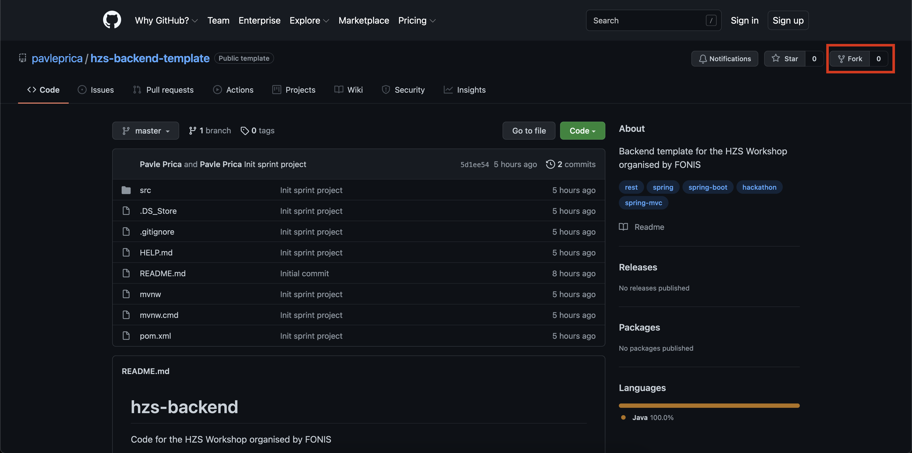
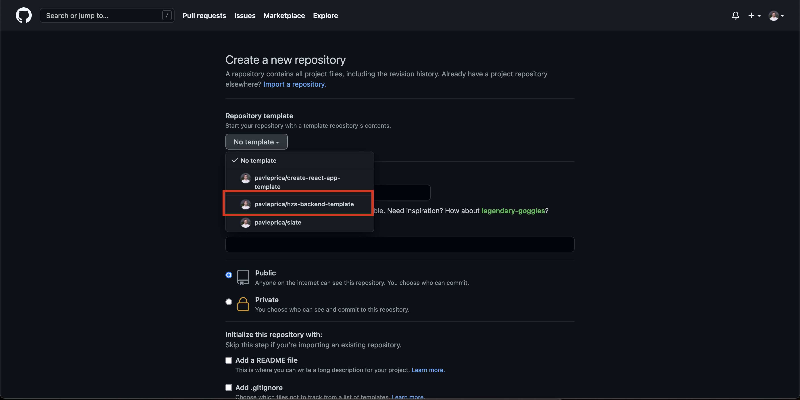

# Hzs-backend template

## About

Template Spring project made for the [HZS hackathon](https://fonis.rs/hakaton-za-srednjoskolce/)
workshop.

## How to use it

### Fork it

We want to start with forking the repository, especially in case we want to
modify it.

Go to the [repo link](https://github.com/pavleprica/hzs-backend-template) and in the upper
right corner click the fork button.

### Create a new repository

Now we want to create the repository. When logging in and starting the create 
new repository process, select the template from the list.

### Go do some amazing work!